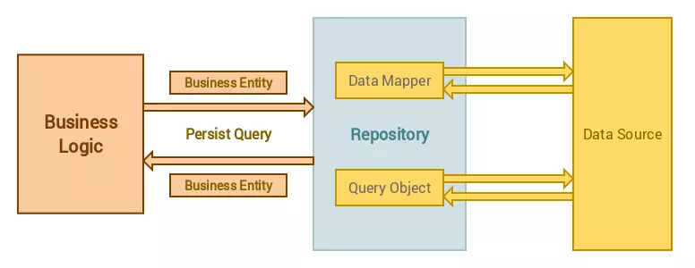

# Base Laravel

Base Laravel is used to abstract the data layer, making our application more flexible to maintain.

You want to know a little more about the Repository pattern? [Read this great article](http://bit.ly/1IdmRNS).

use L5-repository: https://github.com/andersao/l5-repository

## Installation

### Composer

Execute the following command to get the latest version of the package:

```terminal
composer require prettus/l5-repository
```

### Laravel

#### >= laravel5.5

ServiceProvider will be attached automatically

#### Other

In your `config/app.php` add `Prettus\Repository\Providers\RepositoryServiceProvider::class` to the end of the `providers` array:

```php
'providers' => [
    ...
    Prettus\Repository\Providers\RepositoryServiceProvider::class,
],
```

If Lumen

```php
$app->register(Prettus\Repository\Providers\LumenRepositoryServiceProvider::class);
```

Publish Configuration

```shell
php artisan vendor:publish --provider "Prettus\Repository\Providers\RepositoryServiceProvider"
```

## Methods

### Prettus\Repository\Contracts\RepositoryInterface

- all($columns = array('*'))
- first($columns = array('*'))
- paginate($limit = null, $columns = ['*'])
- find($id, $columns = ['*'])
- findByField($field, $value, $columns = ['*'])
- findWhere(array $where, $columns = ['*'])
- findWhereIn($field, array $where, $columns = [*])
- findWhereNotIn($field, array $where, $columns = [*])
- findWhereBetween($field, array $where, $columns = [*])
- create(array $attributes)
- update(array $attributes, $id)
- updateOrCreate(array $attributes, array $values = [])
- delete($id)
- deleteWhere(array $where)
- orderBy($column, $direction = 'asc');
- with(array $relations);
- has(string $relation);
- whereHas(string $relation, closure $closure);
- hidden(array $fields);
- visible(array $fields);
- scopeQuery(Closure $scope);
- getFieldsSearchable();
- setPresenter($presenter);
- skipPresenter($status = true);


### Prettus\Repository\Contracts\RepositoryCriteriaInterface

- pushCriteria($criteria)
- popCriteria($criteria)
- getCriteria()
- getByCriteria(CriteriaInterface $criteria)
- skipCriteria($status = true)
- getFieldsSearchable()

### Prettus\Repository\Contracts\CacheableInterface

- setCacheRepository(CacheRepository $repository)
- getCacheRepository()
- getCacheKey($method, $args = null)
- getCacheTime()
- skipCache($status = true)

### Prettus\Repository\Contracts\PresenterInterface

- present($data);

### Prettus\Repository\Contracts\Presentable

- setPresenter(PresenterInterface $presenter);
- presenter();

### Prettus\Repository\Contracts\CriteriaInterface

- apply($model, RepositoryInterface $repository);

### Prettus\Repository\Contracts\Transformable

- transform();

### Repositories\Traits\RepositoryTraits

- firstByWhere();
- firstById();
- multiDelete();
- buildOrderBy();
- buildLimit();
- buildRelationShip();
- isValidKey();
## Usage

### Create a Model

Create your model normally, but it is important to define the attributes that can be filled from the input form data.

```php
namespace App;

class Post extends Eloquent { // or Ardent, Or any other Model Class

    protected $fillable = [
        'title',
        'author',
        ...
     ];

     ...
}
```

### Create a Repository

```php
namespace App;

use Prettus\Repository\Eloquent\BaseRepository;

class PostRepository extends BaseRepository {

    /**
     * Specify Model class name
     *
     * @return string
     */
    function model()
    {
        return "App\\Post";
    }
}
```

### Generators

Create your repositories easily through the generator.

#### Config

You must first configure the storage location of the repository files. By default is the "app" folder and the namespace "App". Please note that, values in the `paths` array are acutally used as both *namespace* and file paths. Relax though, both foreward and backward slashes are taken care of during generation.

```php
    ...
    'generator'  => [
        'basePath'      => app()->path(),
        'rootNamespace' => 'App\\',
        'stubsOverridePath' => app()->path(),
        'paths'         => [
            'models'       => 'Entities',
            'repositories' => 'Repositories',
            'interfaces'   => 'Repositories',
            'transformers' => 'Transformers',
            'presenters'   => 'Presenters',
            'validators'   => 'Validators',
            'controllers'  => 'Http/Controllers',
            'provider'     => 'RepositoryServiceProvider',
            'criteria'     => 'Criteria'
        ]
    ]
```


#### Commands

To generate everything you need for your Model, run this command:

```terminal
php artisan make:entity Post
```

To generate a repository for your Post model, use the following command

```terminal
php artisan make:repository Post
```

### Use methods

```php
namespace App\Http\Controllers;

use App\PostService;

class PostsController extends BaseController {

    /**
     * @var PostService
     */
    protected $postService;

    public function __construct(PostService $postService){
        $this->postService = $postService;
    }

    ....
}
```
###System Architecture



Controller -> Business Logic(Service) -> Repository  -> Data Source (Modal)
  
###Directory Structure    

```
├───Console
├───Enums
├───Exceptions
├───Helpers
├───Http
│   ├───Controllers
│   │   └───Api
│   ├───Middleware
│   └───Requests
│       ├───Api
│       └───Auth
├───Models
├───Presenters
├───Providers
├───Repositories
│   ├───Contracts
│   ├───Eloquent
│   └───Traits
├───Services
│   ├───Api
│   ├───Contracts
│   └───Traits
└───Transformers


